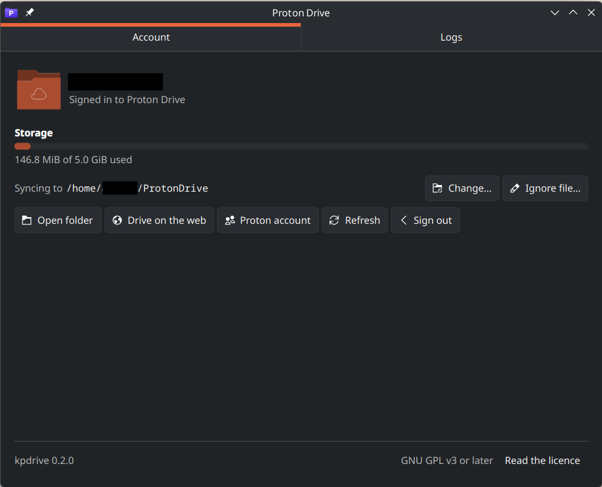

# kpdrive

Simple KDE Proton Drive sync Client designed to have a simple solution.



## Features

- **Sync** ProtonDrive main folder
- **Photos Sync** with some caviats
- **KDE** and **Dolphin** integration
- **.protonignore** with same syntax as .gitignore to ignore files to upload. .protonignore is still pushed though.
- **Localization** support

## Design decisions

- Should be simple to use
- **Sync only**, no FUSE mount
- Using official [proton-crypto-rs](https://github.com/ProtonMail/proton-crypto-rs)
- kpdrive rus as daemon or as a CLI so it can be used separetely if wanted.

### Photos handling

Messing with the timeline is harder than you might think.

- Read-only timeline
- Ingestion Folder, by default ~/Pictures/ProtonDriveIngestion

What works today is the read-only half: ``kpdrive photos`` fetches once, and
*photos_sync* has the daemon do it every half hour. Photos land in
``<photos_sync_folder>/YYYY/MM/``, each file's modified time set to when the
photo was taken. That folder may not be inside the sync folder, or the file
sync would upload the whole library back into Drive as ordinary files. The
first run downloads the whole timeline, which on most accounts is the largest
thing kpdrive will ever do.

Ingestion is not built yet. What it has to produce for each photo, what happens
to the local file afterwards, and the things the download half gets wrong
today, are in [docs/photos-plan.md](docs/photos-plan.md). For now: a photo
deleted in Proton stays on disk, a photo edited in Proton keeps its old copy,
and deleting a local copy brings it back on the next pass.

#### Photos Timeline Edge Cases

> These are edge cases explaining why edit or pushing directly into the timeline isn't done yet

- It's Proton Photos that will determine where in your timeline the photo is. As such, it's hard to make accurate predictions as it might evolve over time.
- Editing a photo in a timeline might change the metadata and thus it might change the way Proton Photos puts your photo in the timeline.


## Usage

### kpdrive CLI / daemon

```
kpdrive login                 # browser sign-in, session stored in KWallet
kpdrive status
kpdrive ls [path]
kpdrive get <remote> [local]
kpdrive put <local> [remote-folder]   # new file, or new revision if the name exists
kpdrive mkdir <remote>
kpdrive photos [--dest DIR]   # download the Photos timeline
kpdrive share <path> [--copy] [--password P] [--expires-days N]
kpdrive unshare <path>
kpdrive setup [--root DIR]    # local folder, ignore file, Places entry, autostart, launcher
kpdrive sync [--root DIR] [--watch] [--force]   # two-way Drive <-> local; --watch = daemon with tray
kpdrive logs [--search TERM] [--lines N] [--retention DAYS]
kpdrive logout
```

### Configuration

Stored in `~/.config/kpdrive/config.json`. The window writes it, and the daemon
re-reads it every pass, so a change takes effect without a restart (the sync
folder is the exception: a running daemon keeps the one it started with).
Missing keys take the default, so the file only needs what you change.

- *sync_folder* : path of the folder to sync ProtonDrive, by default `~/ProtonDrive`
- *log_level* : least severe line kept in the log, `INFO`, `WARN` or `ERROR`. `WARN` by default; the CLI prints its activity whatever this says
- *log_retention_days* : Days of logs, `30` by default
- *photos_sync* : boolean, true if the daemon downloads photos as well, every half hour. `false` by default
- *photos_sync_folder* : path of the folder photos are copied into, by default `~/Pictures/ProtonDrive`. May not be inside *sync_folder*
- *photos_ingestion_folder* : path of the folder to ingest Photos from, `~/Pictures/ProtonDriveIngestion` when it lands. **Not acted on yet**, see [docs/photos-plan.md](docs/photos-plan.md)
- *photos_ingestion_perm_rm* : boolean, true if an ingested photo is deleted outright on successful upload, otherwise moved to trash. `false` by default. **Not acted on yet**

`<sync_folder>/.protonignore` lists paths sync leaves alone, in `.gitignore`
syntax; the window's **Ignore file…** opens it.

### Logs

`~/.local/share/kpdrive/logs/YYYY-MM-DD.log` as plain text

### Sync State

Sync state lives in `~/.local/share/kpdrive/state.json`. Rules:

- Edited on one side only: copied to the other side.
- Edited on **both** sides: both versions are kept. The remote version takes the
  name; the local one becomes `name (conflict copy 2026-09-19 18-30-26).ext` and
  is uploaded as a new file in the same pass. Contents are compared first, so
  two identical files are never split into a copy. Timestamps in those names
  are UTC.
- Deleted locally, unchanged remotely: trashed remotely (restorable in the web app).
- Deleted locally but changed remotely: the remote version is restored, because
  a deletion must not discard someone else's edit.
- Removed remotely: deleted locally only if untouched since we wrote it.
Set `KPDRIVE_DEBUG=1` for event-page diagnostics.

#### Photos Sync State

Photos are a separate volume with a flat, capture-time-ordered timeline, so
`photos` is its own command and writes to `<photos_sync_folder>/YYYY/MM/`,
`~/Pictures/ProtonDrive` by default (what has been downloaded is recorded in
`photos.json`). It only downloads. The destination must be outside the
file sync folder, or the file sync would upload the whole library back into
Drive; kpdrive refuses that rather than letting it happen.

`share` returns a public read-only link. The URL ends in `#<password>`: that
fragment never leaves the browser, so the link itself is the credential. Keep
it secret, or add `--password` for a second one the recipient must type, which
is deliberately *not* in the URL and has to be sent separately. Passing `share`
a path that already has a link returns that link unchanged. `--copy` puts it on
the clipboard and is what the Dolphin right-click entry uses; `share` accepts a
local path inside the sync folder as well as a remote one.

The daemon (`sync --watch`) shows a Plasma tray icon, sends desktop
notifications for conflicts and errors, and serves `$XDG_RUNTIME_DIR/kpdrive.sock`
(line protocol: `STATUS <path>` → `OK|SYNC|NONE`, `ROOT`, `STATE` → one line of
JSON for the window, `SYNC`, `QUIT`).
The Dolphin overlay plugin in `dolphin-overlay/` uses that socket; see its README.

## Build

```
cargo build                 # CLI and daemon
cargo build -p kpdrive-ui   # the window; needs qt6-qtdeclarative-devel and kf6-kirigami
```

### Translations

Catalogs live in `po/` and are compiled into the binaries at build time, so
there is nothing to install and `gettext` is a build dependency. The language
comes from `LC_ALL`, `LC_MESSAGES` or `LANG`; anything without a catalog falls
back to English.

```bash
./po/make-pot.sh                        # rebuild the template from Rust and QML,
                                        # and merge it into every existing .po
msginit --no-translator -l nl -i po/kpdrive.pot -o po/nl.po   # start a language
LC_ALL=fr_BE.UTF-8 kpdrive-ui           # see it
```

The window, the notifications and the wording the terminal shares with the
window are translated. Log lines are not: they are a support tool, and a report
nobody can grep is worth less than one in the wrong language. The rest of the
terminal output is not translated yet.

## Install

### RPM

1. Download rpm files from release that matches your distribution, ex: fc43 or fc44 for Fedora 43 & 44
1. ``sudo rpm -i kpdrive<xxx>.rpm`` installs base daemon/cli
1. ``sudo rpm -i kpdrive-dolphin<xxx>.rpm`` installs dolphin integration (icon overlay and right click menu)
1. ``sudo rpm -i kpdrive-ui<xxx>.rpm`` installs KDE ui

### DEB

Built on Debian 13 (trixie). ``apt`` is used rather than ``dpkg`` so the
dependencies come with it; the ``./`` in front of the file name is what tells
apt it is a file and not a package name.

1. Download the deb files from the release, ignoring the ``-dbgsym`` ones (debug symbols, not needed to run)
1. ``sudo apt install ./kpdrive_<xxx>_amd64.deb`` installs base daemon/cli
1. ``sudo apt install ./kpdrive-dolphin_<xxx>_amd64.deb`` installs dolphin integration (icon overlay and right click menu)
1. ``sudo apt install ./kpdrive-ui_<xxx>_amd64.deb`` installs KDE ui

### Initial Setup

1. ``kpdrive-ui`` to set-up your account in GUI (or see usage for CLI)
1. ``kpdrive sync --watch`` to have daemon with tray

> Don't forget to reload Dolphin to see icon overlay.
> Check Autostart to add kpdrive.

### Uninstall

### RPM

```bash
sudo dnf remove kpdrive kpdrive-dolphin kpdrive-ui
```

### DEB

```bash
sudo apt remove kpdrive kpdrive-dolphin kpdrive-ui
```

## Releases

Pushing a version tag builds packages and publishes them as a GitHub release.
The tag is the single source of truth for the version, and the workflow refuses
to build if the crates disagree with it:

```
# bump both crates first, then
git commit -am "Release 0.x.0"
git tag -a v0.x.0 -m "kpdrive 0.x.0"
git push origin dev v0.x.0
```

A tag containing a hyphen (`v0.x.0-rc1`) is published as a pre-release, and
`.github/workflows/release.yml` can also be run by hand against an existing tag.

| Target | Built in | Packages |
| --- | --- | --- |
| Fedora, current and previous release | `fedora:44`, `fedora:43` | `kpdrive`, `kpdrive-ui`, `kpdrive-dolphin` (plus the source RPM) |
| Debian stable | `debian:trixie` | the same three as `.deb` |

Bump the Fedora numbers in both workflows when Fedora moves on; every filename
carries its dist tag, so which is which is never in doubt. The Debian build
installs Rust through rustup rather than using the distro package, because
Debian stable ships 1.85 while some dependencies want 1.92.

`kpdrive` holds the CLI and the daemon, `kpdrive-ui` the window, and
`kpdrive-dolphin` the overlay icons and the context-menu entry. Installing them
does *not* start syncing on its own; `kpdrive setup` is still how you choose a
folder and opt into autostart.

Every push and pull request runs the build, the tests, the Dolphin plugin and a
spec parse check on both Fedora releases, plus a fast validation of the Debian
control and changelog files.

To build packages locally:

```
rpmbuild -ba --define "kpdrive_version 0.2.0" packaging/kpdrive.spec  # needs a matching tarball in ~/rpmbuild/SOURCES
dpkg-buildpackage -b -us -uc                                          # on Debian
```

## Licence

GNU GPL v3 **or later** (`GPL-3.0-or-later`); see [LICENSE](LICENSE).

Every library kpdrive links permits this. Qt 6 here is `LGPL-3.0-only`, which
explicitly allows conveying the result under GPL v3. The KDE Frameworks behind
the Dolphin plugin are `LGPL-2.0-or-later`, and `KOverlayIconPlugin` itself is
`LGPL-2.0-only OR LGPL-3.0-only OR LicenseRef-KDE-Accepted-LGPL`, so the v3
option applies. Three Rust dependencies are Apache-2.0 with no alternative
(`sync_wrapper` at run time, `clang-sys` and `codespan-reporting` at build
time); Apache-2.0 is compatible with GPL v3 and *not* with GPL v2, which is what
ruled v2 out. Everything else is MIT, BSD, Unicode or dual MIT/Apache.
